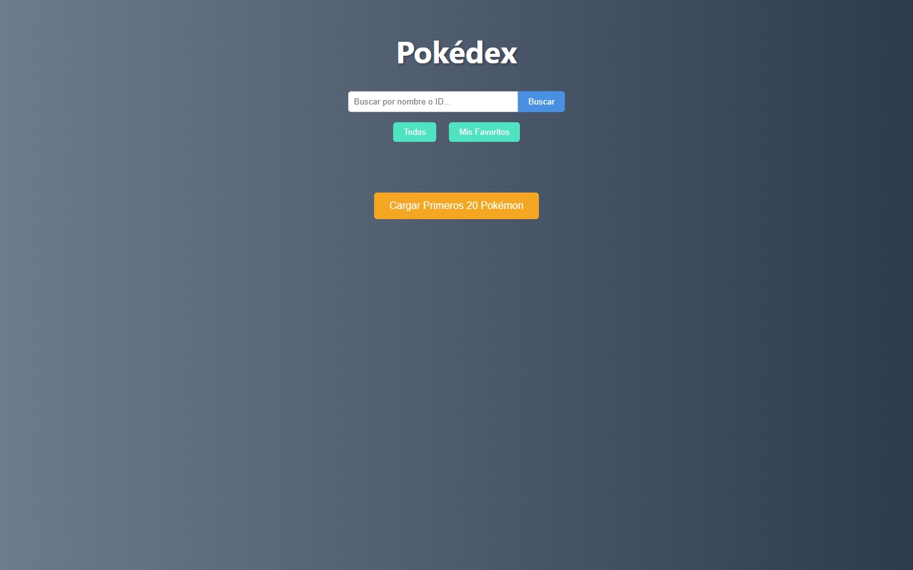
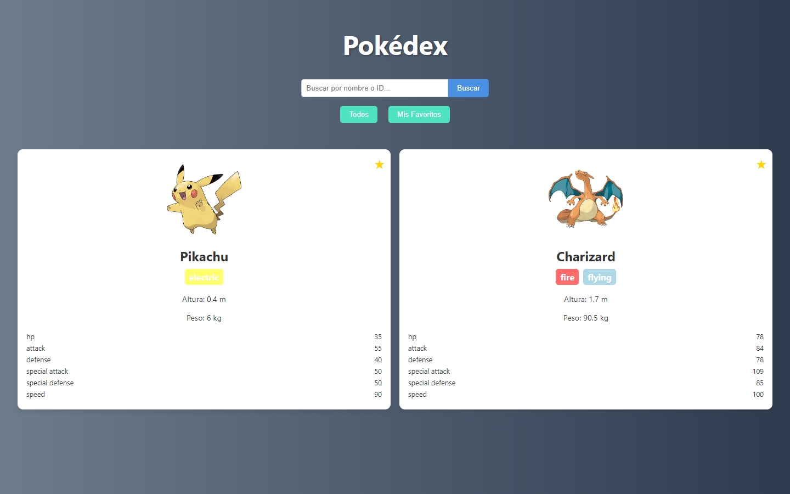
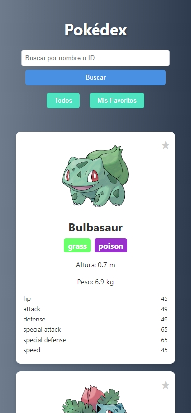

# Mini Pokédex Web

## 📸 Vistas Previas

| Vista de Escritorio | Vista de Favoritos | Vista Móvil |
| :---: | :---: | :---: |
|  |  |  |

Una aplicación web interactiva que permite a los usuarios buscar Pokémon, ver sus detalles y gestionar una lista de favoritos. Este proyecto consume la [PokéAPI](https://pokeapi.co/) para obtener datos en tiempo real y está construido con HTML, CSS y JavaScript puro, demostrando una sólida manipulación del DOM y un diseño web responsivo.

**Demo en vivo:** https://giobok10.github.io/mini-pokedex-web/

## ✨ Características Principales

*   **Búsqueda de Pokémon:** Busca Pokémon por nombre o número de ID.
*   **Catálogo Dinámico:** Carga una lista inicial de Pokémon y explora sus detalles.
*   **Información Completa:** Visualiza nombre, imagen, tipos, altura, peso y estadísticas base de cada Pokémon.
*   **Sistema de Favoritos:** Marca y desmarca tus Pokémon preferidos. Los favoritos se guardan localmente en tu navegador usando `localStorage`.
*   **Navegación Sencilla:** Cambia fácilmente entre la vista de todos los Pokémon y tu lista personal de favoritos.
*   **Diseño Responsivo:** Interfaz completamente adaptada para una experiencia óptima tanto en dispositivos de escritorio como móviles.

## 🛠️ Tecnologías Utilizadas

*   **HTML5:** Para la estructura semántica del contenido.
*   **CSS3:** Para el diseño y la maquetación, siguiendo la metodología **BEM (Block, Element, Modifier)** para un código escalable y mantenible.
*   **JavaScript (ES6+):** Para toda la lógica de la aplicación, incluyendo:
    *   Consumo de API con `fetch`.
    *   Manipulación dinámica del DOM.
    *   Manejo de eventos.
    *   Persistencia de datos con `localStorage`.
*   **PokéAPI:** Como fuente de datos de los Pokémon.

## 🚀 Instalación y Uso

No se requiere ninguna instalación especial. Simplemente clona este repositorio y abre el archivo `index.html` en tu navegador web preferido.

```bash
git clone https://github.com/tu-usuario/tu-repositorio.git
```

## 👤 Autor

**Guillermo Mendez** 
*   [GitHub](https://github.com/giobok10)
